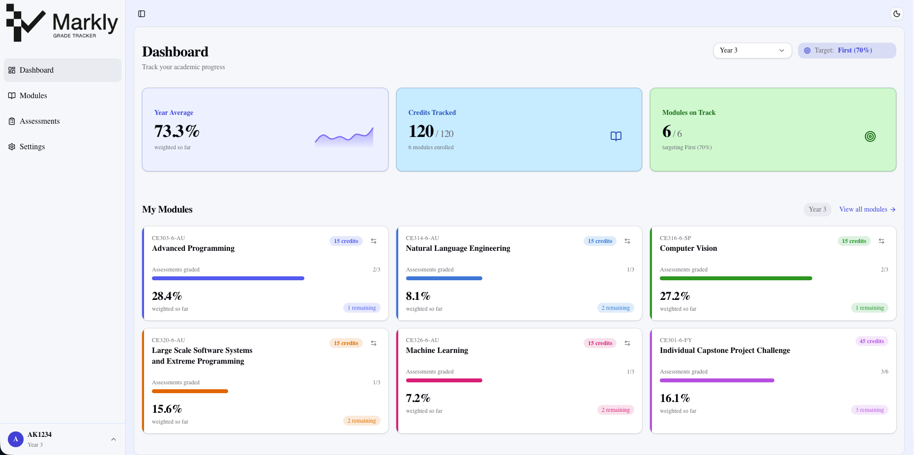
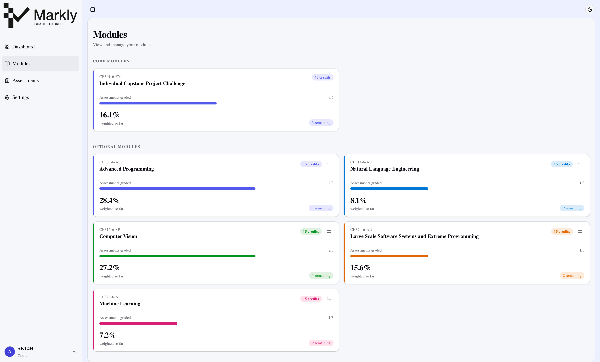
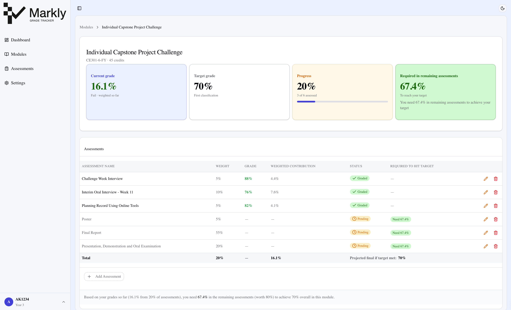
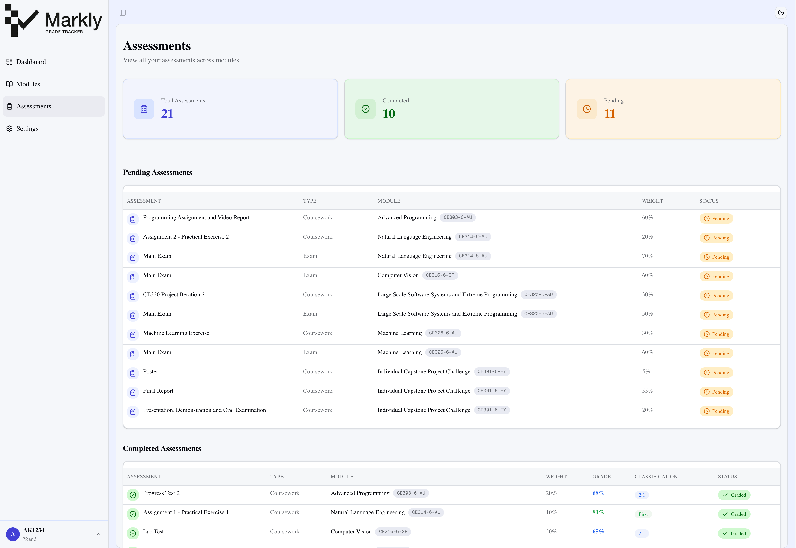

# Markly


A comprehensive grade tracking platform designed specifically for University of Essex Computer Science students. Markly enables students to monitor their academic performance, track module assessments, and visualise their progress toward degree classification goals.

## Overview

Markly is a web-based application that simplifies academic record-keeping for computer science students. Built with modern web technologies, it provides an intuitive interface for managing module information, logging assessment grades, and gaining insights into overall academic performance through weighted grade calculations and progress analytics.

## Features

### Onboarding Flow

New students complete a structured onboarding process:

1. **Authentication** - Sign up or sign in with university credentials
2. **Profile Setup** - Configure personal information and target grade
3. **Module Selection** - Choose core and optional modules for the current year
4. **Ready to Track** - Begin logging assessments and monitoring progress

### Dashboard



The dashboard provides a comprehensive overview of your academic journey:

- **Year Average**: Calculated from all graded assessments using a weighted average, with each assessment contributing according to its weight
- **Credits Tracked**: Visual representation of completed versus total credits (120 total)
- **Modules On Track**: Count of modules where you are on track to meet your target degree classification

### Module Management



- Enrol in core and optional modules from the University of Essex Computer Science curriculum
- View complete module information including credits and assessment structure
- Track progress within each module across multiple assessment types
- Support for 33+ modules across levels 4, 5, and 6

### Module Detail



The module detail view gives students a full breakdown of a single module so they can understand exactly how their grade is built and what remains to be completed. It includes:

- Current module grade and target grade
- Overall progress as a weighted percentage of completed assessments
- Remaining grade required to achieve the target classification
- A table of assessments showing grade, weight, contribution, status, and the grade required to hit your target classification for each specific assessment
- The ability to add custom assessments beyond the standard assessment scheme
- Quick actions for updating or removing assessment entries

### Assessment Tracking



- View pending and completed assessments across your modules
- Filter between completed and pending assessments
- Review assessment weights, grades, and module contributions in one place

### Grade Calculations & Weighted Averages

Markly uses weighted average calculations to provide accurate academic insights:

#### Year Average Calculation

The year average represents your overall performance across all modules:

```
Year Average = Sum(Assessment Grade × Assessment Weight) / Sum(Assessment Weights)
```

For example, if you have:

- Assessment 1: 75% with weight 0.30
- Assessment 2: 82% with weight 0.40
- Assessment 3: 88% with weight 0.30

Your weighted average would be: (75×0.30 + 82×0.40 + 88×0.30) / 1.0 = 81.7%

#### Module Grade Calculation

Each module combines multiple assessment components according to the assessment scheme:

```
Module Grade = Sum(Assessment Grade × Component Weight) / Sum(Component Weights)
```

Assessment weights are determined by the module's official assessment scheme obtained from the University of Essex and may include coursework, exams, practical components, and projects.

#### Target Grade Tracking

For each module, Markly calculates whether you are "on track" to achieve your target degree classification:

```
Required Grade for Remaining = (Target Grade - Current Grade) / Remaining Weight
```

If this value is ≤ 100, the module is marked as "on track."

### Profile & Settings

- Manage your student profile and personal information
- Set your target degree classification (First, 2:1, or 2:2)
- View and update your enrolled modules
- Customise your learning preferences

### Additional Features

- **Real-Time Analytics**: Watch your year average update as you log new grades and identify which modules need improvement
- **Flexible Assessment Logging**: Add custom assessments beyond the standard scheme and record them as you complete them throughout the year
- **Progress Visualisation**: Progress bars for credit accumulation and colour-coded indicators for module performance
- **Mobile-Responsive Design**: Fully functional on mobile devices and tablets with a touch-friendly interface

## Understanding Your Grade Data

### Degree Classifications

Markly tracks progress toward the following UK degree classifications:

| Classification     | Range   | Target |
| ------------------ | ------- | ------ |
| First              | 70-100% | 70%+   |
| Upper Second (2:1) | 60-69%  | 60%+   |
| Lower Second (2:2) | 50-59%  | 50%+   |

### Assessment Types

Different modules use various assessment methods:

- **Coursework**: Submitted written work or projects
- **Exam**: Formal examination component
- **Practical**: Lab work or practical assignments
- **Presentation**: Oral presentations or demonstrations
- **Project**: Extended project work or capstone projects

Each assessment type has an assigned weight that contributes to the final module grade.

### Important Notes

- Weighted averages are calculated automatically as assessments are logged
- All calculations follow University of Essex assessment regulations
- Year average reflects only completed assessments; missing assessments are excluded
- Module grades update in real time as new assessment grades are entered
- Target tracking assumes you will achieve 100% on all remaining assessments

## Module Reference

All module information, including course codes, names, credits, and assessment schemes, is sourced from the [University of Essex official course database](https://www1.essex.ac.uk/modules/Default.aspx). Below is the complete reference for all available modules:

| ID  | Code       | Name                                                                                                                                          | Level   |
| --- | ---------- | --------------------------------------------------------------------------------------------------------------------------------------------- | ------- |
| 1   | CE101-4-FY | [Team Project Challenge](https://www1.essex.ac.uk/modules/Default.aspx?coursecode=CE101&level=4&period=FY&campus=CO&year=26)                  | Level 4 |
| 2   | CE141-4-FY | [Mathematics for Computing](https://www1.essex.ac.uk/modules/Default.aspx?coursecode=CE141&level=4&period=FY&campus=CO&year=26)               | Level 4 |
| 3   | CE151-4-AU | [Introduction to Programming](https://www1.essex.ac.uk/modules/Default.aspx?coursecode=CE151&level=4&period=AU&campus=CO&year=26)             | Level 4 |
| 4   | CE152-4-SP | [Object-Oriented Programming](https://www1.essex.ac.uk/modules/Default.aspx?coursecode=CE152&level=4&period=SP&campus=CO&year=26)             | Level 4 |
| 5   | CE153-4-AU | [Introduction to Databases](https://www1.essex.ac.uk/modules/Default.aspx?coursecode=CE153&level=4&period=AU&campus=CO&year=26)               | Level 4 |
| 6   | CE154-4-SP | [Web Development](https://www1.essex.ac.uk/modules/Default.aspx?coursecode=CE154&level=4&period=SP&campus=CO&year=26)                         | Level 4 |
| 7   | CE104-4-SP | [Data Structures and Algorithms I](https://www1.essex.ac.uk/modules/Default.aspx?coursecode=CE104&level=4&period=SP&campus=CO&year=26)        | Level 4 |
| 8   | CE161-4-AU | [Fundamentals of Digital Systems](https://www1.essex.ac.uk/modules/Default.aspx?coursecode=CE161&level=4&period=AU&campus=CO&year=26)         | Level 4 |
| 9   | CE201-5-FY | [Team Project Challenge](https://www1.essex.ac.uk/modules/Default.aspx?coursecode=CE201&level=5&period=FY&campus=CO&year=26)                  | Level 5 |
| 10  | CE202-5-XA | [Software Engineering](https://www1.essex.ac.uk/modules/Default.aspx?coursecode=CE202&level=5&period=XA&campus=CO&year=26)                    | Level 5 |
| 11  | CE203-5-AU | [Application Programming](https://www1.essex.ac.uk/modules/Default.aspx?coursecode=CE203&level=5&period=AU&campus=CO&year=26)                 | Level 5 |
| 12  | CE204-5-AU | [Data Structures and Algorithms II](https://www1.essex.ac.uk/modules/Default.aspx?coursecode=CE204&level=5&period=AU&campus=CO&year=26)       | Level 5 |
| 13  | CE205-5-AU | [Databases and Information Retrieval](https://www1.essex.ac.uk/modules/Default.aspx?coursecode=CE205&level=5&period=AU&campus=CO&year=26)     | Level 5 |
| 14  | CE207-5-SP | [Introduction to Data Science](https://www1.essex.ac.uk/modules/Default.aspx?coursecode=CE207&level=5&period=SP&campus=CO&year=26)            | Level 5 |
| 15  | CE212-5-SP | [Web Application Programming](https://www1.essex.ac.uk/modules/Default.aspx?coursecode=CE212&level=5&period=SP&campus=CO&year=26)             | Level 5 |
| 16  | CE213-5-SP | [Introduction to Artificial Intelligence](https://www1.essex.ac.uk/modules/Default.aspx?coursecode=CE213&level=5&period=SP&campus=CO&year=26) | Level 5 |
| 17  | CE217-5-SP | [Computer Game Design](https://www1.essex.ac.uk/modules/Default.aspx?coursecode=CE217&year=26)                                                | Level 5 |
| 18  | CE218-5-SP | [Computer Game Programming](https://www1.essex.ac.uk/modules/Default.aspx?coursecode=CE218&year=26)                                           | Level 5 |
| 19  | CE221-5-AU | [C++ Programming](https://www1.essex.ac.uk/modules/Default.aspx?coursecode=CE221&level=5&period=AU&campus=CO&year=26)                         | Level 5 |
| 20  | CE231-5-SP | [Computer and Data Networks](https://www1.essex.ac.uk/modules/Default.aspx?coursecode=CE231&level=5&period=SP&campus=CO&year=26)              | Level 5 |
| 21  | CE235-5-SP | [Computer Security](https://www1.essex.ac.uk/modules/Default.aspx?coursecode=CE235&level=5&period=SP&campus=CO&year=26)                       | Level 5 |
| 22  | CE301-6-FY | [Individual Capstone Project Challenge](https://www1.essex.ac.uk/modules/Default.aspx?coursecode=CE301&level=6&period=FY&campus=CO&year=26)   | Level 6 |
| 23  | CE303-6-AU | [Advanced Programming](https://www1.essex.ac.uk/modules/Default.aspx?coursecode=CE303&level=6&period=AU&campus=CO&year=26)                    | Level 6 |
| 24  | CE305-6-SP | [Languages and Compilers](https://www1.essex.ac.uk/modules/Default.aspx?coursecode=CE305&year=26)                                             | Level 6 |
| 25  | CE310-6-SP | [Evolutionary Computation and Genetic Programming](https://www1.essex.ac.uk/modules/Default.aspx?coursecode=CE310&year=26)                    | Level 6 |
| 26  | CE314-6-AU | [Natural Language Engineering](https://www1.essex.ac.uk/modules/Default.aspx?coursecode=CE314&year=26)                                        | Level 6 |
| 27  | CE316-6-SP | [Computer Vision](https://www1.essex.ac.uk/modules/Default.aspx?coursecode=CE316&year=26)                                                     | Level 6 |
| 28  | CE318-6-AU | [High-Level Games Development](https://www1.essex.ac.uk/modules/Default.aspx?coursecode=CE318&year=26)                                        | Level 6 |
| 29  | CE320-6-AU | [Large Scale Software Systems and Extreme Programming](https://www1.essex.ac.uk/modules/Default.aspx?coursecode=CE320&year=26)                | Level 6 |
| 30  | CE321-6-AU | [Network Engineering](https://www1.essex.ac.uk/modules/Default.aspx?coursecode=CE321&year=26)                                                 | Level 6 |
| 31  | CE324-6-SP | [Network Security](https://www1.essex.ac.uk/modules/Default.aspx?coursecode=CE324&year=26)                                                    | Level 6 |
| 32  | CE326-6-AU | [Machine Learning](https://www1.essex.ac.uk/modules/Default.aspx?coursecode=CE326&year=26)                                                    | Level 6 |
| 33  | CE812-6-SP | [Physics-Based Games](https://www1.essex.ac.uk/modules/Default.aspx?coursecode=CE812&year=26)                                                 | Level 6 |

## Getting Started

### Prerequisites

- Node.js 18+ and npm
- A modern web browser
- University of Essex account credentials
- Supabase account (backend infrastructure)

### Installation

1. Clone the repository:

```bash
git clone <repository-url>
cd markly
```

2. Install dependencies:

```bash
npm install
```

3. Set up environment variables. Create a `.env.local` file in the project root with your Supabase credentials:

```
NEXT_PUBLIC_SUPABASE_URL=your_supabase_url
NEXT_PUBLIC_SUPABASE_PUBLISHABLE_KEY=your_supabase_publishable_key
BETTER_AUTH_SECRET=your_better_auth_secret
BETTER_AUTH_URL=http://localhost:3000
DATABASE_URL=your_database_url
APP_URL=http://localhost:3000
```

4. Start the development server:

```bash
npm run dev
```

5. Open [http://localhost:3000](http://localhost:3000) in your browser

### Building for Production

```bash
npm run build
npm start
```

## Technology Stack

**Frontend:**

- Next.js 16 - React framework with server-side rendering
- React 19 - UI library
- TypeScript - Type-safe development
- TailwindCSS - CSS framework
- Recharts - Data visualisation library
- Lucide React - Icon library
- shadcn/ui - Component library
- Radix UI - Component primitives
- Zustand - Lightweight state management

**Backend:**

- Supabase - PostgreSQL database
- Better Auth - Authentication
- React Hook Form - Form handling
- Zod - Schema validation

## Privacy & Security

- Authentication is managed through Better Auth
- Row-level security policies ensure students can only access their own data
